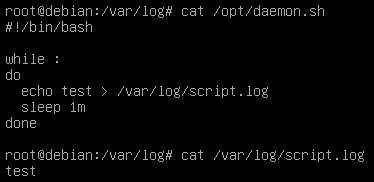
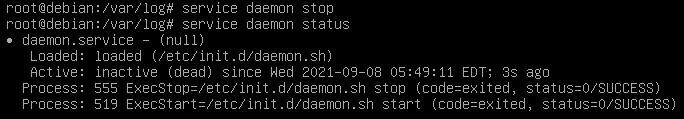
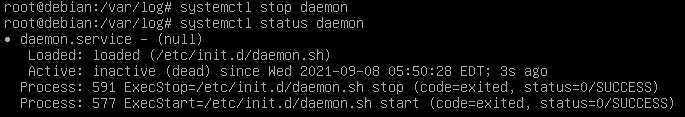

1. Назовите основные отличия и преимущества systemd от sysvinit, опишите подходы.
 - sysvinit запускает процессы последовательно исходя из фазы загрузки
 - systemd сначала исполняет default.target, а затем строит дерево зависимостей
 - systemd поддерживает активацию сервисов на основе сокетов
 - в sysvinit система runlevel, в systemd target
2. Каким образом происходит параллельный запуск всех процессов но в то же время сервисы стартуют с нужными зависимостями друг относительно друга
 - systemd по дереву зависимостей определяет необходимые для запуска демона сервисы и запускает их параллельно.
3. каким образом проверить работает процесс в sysvinit и в systemd?
 - sysvinit: chkconfig service_name
 - systemd: systemctl status unit
4. Как добавить в автозагрузку init скрипт в sysvinit и в systemd?
 - sysvinit: добавить скрипт в директорию /etc/init.d и выполнить chkconfig service_name on
 - systemd: добавить файл в /etc/systemd/system и выполнить systemctl enable service_name
5. Как посмотреть логи в системе systemd по нужному нам процесс  
   journalctl -u service_name
   
   
# Задачи:
 - написать простой скрипт на любом языке программирования который будет работать в режиме демона  
 /opt/daemon.sh

 ```bash
 #!/bin/bash

 while :
 do
   echo test > /var/log/script.log
   sleep 2m
 done
 ```

 - установить дистрибутив Debian 8 и написать sysvnit скрипт для запуска процесса, добавить в автозагрузку, проверить автозагрузку и работу start stop 
аргументов  
 /etc/init.d/daemon.sh

  

update-rc.d daemon.sh start







 - Установить Debian 10, написать systemd unit, ш в автозагрузку, проверить что скрипт запускается после рестарта, проверить start stop status unit-а  

 /etc/systemd/system/daemon.service:





 - написать timer для systemd который раз в 5 минут пишет что-либо в лог файл  


   
